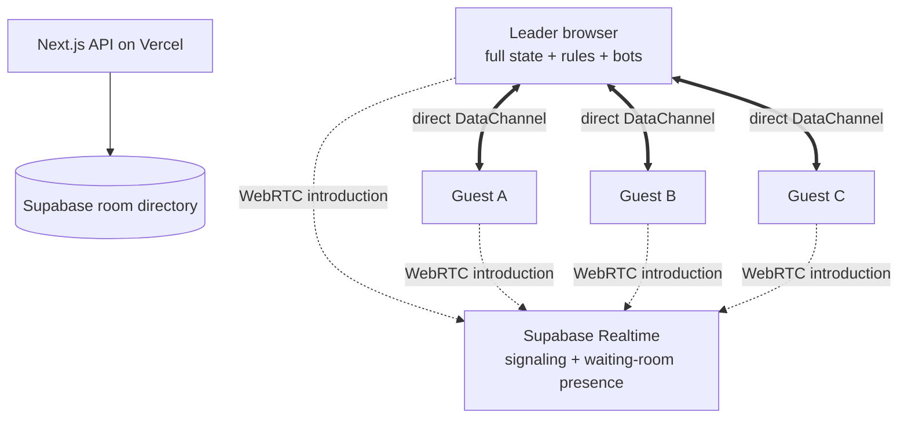

# Liar's Orbit WebRTC Room Implementation Guide

**Status:** Implemented locally; cloud resource setup pending
**Application:** Harsh Bhardwaj Portfolio, Next.js App Router
**Scope:** Rooms for up to four people, leader-controlled gameplay, client-side bots, direct browser connections, no TURN fallback

## 1. Decisions already made

- The browser that creates a room is its leader.
- Every guest connects directly to the leader through a WebRTC DataChannel.
- The leader owns the complete game state, validates moves, runs timers, deals cards, runs bots, and calculates SAFE or DEAD.
- Guests send player intentions to the leader and render the state returned by the leader.
- Supabase stores only a small room directory and temporary seat records.
- Supabase Realtime Broadcast is used only to negotiate WebRTC connections.
- Supabase Presence is used only for the waiting room and connection visibility.
- Game actions and game state do not travel through Supabase after WebRTC connects.
- There is no TURN relay in the first version. A connection that cannot be established through STUN fails with a clear message.
- If the leader permanently disconnects, the room closes. There is no leader migration.
- The leader is trusted. Preventing the leader from inspecting or modifying the game is outside this casual game's scope.
- A player's chosen display name is remembered locally.

## 2. What Supabase Realtime does

WebRTC peers need a short introduction before they can communicate directly. They must exchange an offer, an answer, and network connection candidates. WebRTC does not define where those introduction messages should travel.

Supabase Realtime Broadcast provides that introduction path:

1. A guest joins the room's unguessable signaling topic after the join API admits the seat.
2. The guest announces its seat to the leader.
3. The leader sends a WebRTC offer addressed to that seat.
4. The guest returns an answer.
5. Both sides exchange connection candidates.
6. The WebRTC DataChannel opens.
7. Game traffic moves entirely to the DataChannel.

Broadcast is not a gameplay relay and is not a TURN fallback. If direct WebRTC negotiation fails, the player is shown a connection error and does not enter the table.

Presence shows who is currently waiting or negotiating. It should update only when a participant joins, leaves, reconnects, or changes connection state. Direct DataChannel heartbeats handle in-game connectivity.

## 3. Final topology

The topology is a star. Guests do not need connections to one another. With four human players, the leader maintains at most three peer connections.

## 4. Responsibility split

| Concern | Owner |
|---|---|
| Create room code | Next.js API + Supabase directory |
| Reserve a seat | Next.js API + Supabase directory |
| Exchange WebRTC setup messages | Supabase Realtime Broadcast |
| Waiting-room online state | Supabase Presence |
| Full game state | Leader browser |
| Private hands | Leader browser and the relevant guest |
| Rules and move validation | Leader browser |
| Bot decisions and five-second delay | Leader browser |
| Turn order and timers | Leader browser |
| In-game heartbeats | WebRTC DataChannels |
| Guest rendering and input | Each guest browser |
| Brief leader-refresh recovery | Leader browser snapshot |
| Permanent leader loss | Close the room |
| Expired-room cleanup | Room-directory lease and periodic cleanup |

## 5. Minimal shared records

The shared database must not contain the deck, hands, claims, results, bot memory, or match history.

### Room directory

- Internal room ID
- Shareable room code
- Unguessable signaling-topic ID
- Hashed leader token
- Waiting, playing, or closed status
- Number of reserved human seats
- Leader's last-seen time
- Expiry time
- Creation time

### Seat directory

- Internal room ID
- Stable seat ID
- Hashed seat token
- Display name
- Joined time
- Last signaling activity
- Waiting, connected, disconnected, or replaced-by-bot status

Only the Next.js API holds the Supabase secret key. The browser receives the safe publishable key. Leader and seat tokens remain opaque random values; only their hashes are stored. A room code can be shared in a URL, but a leader or seat token must never be placed in the URL.

## 6. Local browser storage

### Every participant

- Store the preferred name under one versioned `localStorage` key.
- Store the room code, seat ID, and seat token locally for reconnection.
- Remove expired room credentials when the directory rejects them.

### Leader only

- Store the leader token locally.
- Save the latest complete game snapshot in the leader's browser after every accepted revision.
- Store the room epoch and latest revision with the snapshot.
- Remove the snapshot when the leader intentionally closes the room or the game finishes.

The name survives future visits. Room credentials expire with their room. The leader snapshot is small enough to remain in local browser storage.

## 7. Room lifecycle

### Create

1. The creator enters or confirms a name.
2. The API atomically creates an unused room code and leader seat.
3. The browser stores the leader and seat credentials.
4. The URL becomes `/play?room=ROOM_CODE` without reloading the page.
5. The leader joins the signaling topic and advertises that the room is ready.
6. The invite button copies the current URL.

### Join

1. The guest opens the room URL or enters its code.
2. The API checks that the room exists, is waiting, has capacity, and has a live leader lease.
3. The API atomically reserves one seat and returns a seat token.
4. The guest joins the signaling topic.
5. The leader validates the seat introduction and negotiates one WebRTC connection.
6. The guest enters the lobby only after the DataChannel is open.

### Start

1. The leader locks the human seat list.
2. Bots fill unused seats.
3. The leader creates the game using the existing rules engine.
4. Each peer receives the public table state and only that peer's private view.
5. The room directory changes from waiting to playing.

### Play

1. A guest sends an intention such as play cards, call liar, or pull trigger.
2. The leader checks the seat, phase, turn, expected revision, and action ID.
3. The existing game engine accepts or rejects the move.
4. The leader increments the revision.
5. The leader sends a fresh public snapshot to every connected guest.
6. The leader sends each guest that player's private hand separately.
7. Guests acknowledge the revision. A guest that misses one requests a complete resync.

### Finish or close

1. The leader broadcasts the final result or room-closed event.
2. Peers close their DataChannels.
3. The room directory is marked closed.
4. Local room credentials and the leader snapshot are removed.

## 8. State consistency rules

- Only the leader may produce a new game revision.
- Every accepted action increments the revision exactly once.
- Every player intention includes a unique action ID so retries cannot execute twice.
- Every player intention includes the revision the player saw.
- Stale intentions are rejected and answered with a fresh snapshot.
- Every message includes the room ID, room epoch, sender seat, and message type.
- A leader refresh increments the room epoch so delayed messages from the previous connection are ignored.
- The leader sends complete small snapshots after actions rather than requiring guests to rebuild state from a long event stream.
- The existing rules engine remains the single implementation used by solo mode, the leader, and tests.

## 9. Bots and timers

- Move the multiplayer bot scheduler out of the current server room handler and into the leader controller.
- Keep the existing bot decision function and fixed five-second thinking delay.
- Store timer deadlines as timestamps instead of relying on the number of timer callbacks.
- When the leader tab becomes visible again, immediately reconcile any overdue deadline.
- Broadcast bot actions exactly like accepted human actions.
- Cancel pending bot timers when the phase, revision, or room epoch changes.
- Never allow two bot callbacks to process the same revision.

If the leader's browser is suspended, the game can pause. The room should state that the host must keep the game open. This follows the chosen leader-owned model.

## 10. Heartbeats, disconnects, and expiry

### Participant heartbeat

- Every guest sends a tiny ping to the leader through its DataChannel every 10 seconds.
- The leader answers with a pong and records the latest activity locally.
- After 20 seconds without a heartbeat, show the participant as reconnecting.
- Reserve the seat for a 30-second grace period.
- If the player does not return, replace that player with a bot after a game has started. Remove the seat if the game is still in the lobby.

### Leader lease

- The leader renews one directory lease approximately every 60 seconds.
- A renewal extends the room expiry by five minutes.
- Meaningful room changes can renew the same lease, but must not create extra rapid writes.
- Guests consider the room closed if the leader connection is gone beyond the reconnect grace period.
- Join requests reject rooms whose leader lease has expired.

There is no need to poll when a two-hour timer is nearly finished. A renewable lease continuously answers whether the leader is alive. Expired records can be ignored immediately and deleted periodically in small batches.

### Refresh behavior

- A guest refresh reuses its seat token and reconnects to the same seat.
- A leader refresh restores the last browser snapshot, creates a new room epoch, and renegotiates guest connections.
- If the leader does not return during the grace period, the room closes quietly.
- Browser close events may send an early notice, but timeouts remain authoritative because close events are not guaranteed.

## 11. STUN-only policy

The first release will use STUN and will not configure TURN.

Expected behavior:

- Many home, mobile, and ordinary Wi-Fi combinations will connect directly.
- Some restrictive NAT combinations will fail to create a peer route.
- A failed connection must stop after a bounded negotiation window instead of spinning indefinitely.
- The UI should say that a direct connection could not be made and suggest retrying or changing networks.
- Connection diagnostics should record the WebRTC state and candidate type without recording addresses or private game data.
- TURN can be added later behind the transport layer without changing the room protocol or game engine.

This is an accepted product tradeoff, not an assumption that STUN always succeeds.

## 12. Supabase free-tier limits and exhaustion behavior

Current documented Free Plan allowances relevant to this design:

| Limit | Free allowance | Effect on this game |
|---|---:|---|
| Peak Realtime connections | 200 | At four connected humans per room, 50 full rooms is the absolute mathematical ceiling before other usage |
| Realtime messages | 2 million per billing period | Signaling and presence consume this; direct game traffic does not |
| Realtime messages per second | 100 | Sudden waves of room joins can trigger throttling |
| Channel joins per second | 100 | A large simultaneous reconnect wave can reject joins |
| Presence messages per second | 20 | Presence must describe slow connection changes, not game events |
| Presence calls per client | 5 per 30 seconds | Do not use rapid Presence updates as a heartbeat |
| Broadcast payload | 256 KB | WebRTC negotiation messages are comfortably below this |
| Database size | 500 MB per project | Room metadata is tiny if expired rows are cleaned |
| Egress | 5 GB per organization | Signaling is small; unrelated Supabase usage shares this pool |
| Free projects | 2 active projects | This room directory consumes one if a project is dedicated to it |
| Inactive project policy | May pause after low activity over seven days | A rarely visited portfolio can require manual project restoration |

The quotas are organization-wide where Supabase specifies shared billing usage. Other projects and features can consume the same allowance.

When the 200-connection ceiling is reached, new Realtime connections or channel joins are refused. Already established WebRTC games can continue because their gameplay no longer depends on Supabase. New guests, signaling retries, and reconnects cannot complete until a Realtime slot is available.

When the messages-per-second ceiling is exceeded, Supabase can disconnect Realtime clients and its client library attempts to reconnect after traffic falls. Existing DataChannels can continue. New negotiations should show a temporary capacity message and retry with bounded backoff.

When the monthly message allowance is exhausted, signaling availability is at risk for the remainder of the billing period unless the project is upgraded or the quota resets. Usage must be visible in the Supabase dashboard, with a warning threshold well before exhaustion.

Because a full room uses at most four Realtime connections, a conservative operating target is 25–40 simultaneous rooms on the free tier. The product should never promise 50 rooms because dashboard use, reconnects, and overlapping signaling sessions need headroom.

Sources checked for these limits:

- [Supabase Realtime limits](https://supabase.com/docs/guides/realtime/limits)
- [Supabase billing and free quotas](https://supabase.com/docs/guides/platform/billing-on-supabase)
- [Supabase free-project pausing](https://supabase.com/docs/guides/platform/free-project-pausing)
- [Supabase Realtime Broadcast](https://supabase.com/docs/guides/realtime/broadcast)
- [MDN WebRTC DataChannels](https://developer.mozilla.org/en-US/docs/Web/API/WebRTC_API/Using_data_channels)

## 13. Prioritized implementation checklist

### P0 — Establish the contracts before changing transport

- [ ] Freeze and document the current game-state and player-view shapes.
- [ ] Define message types for introduction, intention, snapshot, private state, acknowledgement, heartbeat, error, and room closed.
- [ ] Add room epoch, revision, and action ID rules.
- [ ] Make every leader operation idempotent.
- [ ] Keep solo play functioning through the same game engine.
- [ ] Define explicit UI states: creating, waiting, negotiating, connected, reconnecting, failed, and closed.

**Implementation overview:** Create a transport-independent room protocol first. This lets the game run over an in-memory test transport before Supabase or WebRTC is introduced.

### P0 — Build the minimal room directory

- [ ] Create the Supabase project and connect its environment variables to Vercel.
- [ ] Add room and seat records with expiry and uniqueness constraints.
- [ ] Keep tables inaccessible directly unless explicitly required; use RLS for anything exposed.
- [ ] Create atomic create-room and reserve-seat operations.
- [ ] Hash leader and seat tokens before storage.
- [ ] Add create, join, reconnect, leader-heartbeat, and close API actions.
- [ ] Add join-rate limiting and bounded room-code generation retries.
- [ ] Return specific public errors for missing, expired, full, started, and unavailable rooms.

**Implementation overview:** Replace the process-local JavaScript map with a small shared directory. These APIs never receive or return complete game state.

### P0 — Move multiplayer authority into the leader browser

- [ ] Create a leader controller around the existing game engine.
- [ ] Move multiplayer bot scheduling and automatic phases to the leader.
- [ ] Produce one public view and one private view per human seat.
- [ ] Validate every guest intention before applying it.
- [ ] Broadcast a fresh revision after every accepted action.
- [x] Save every accepted leader revision in the leader's browser.
- [ ] Keep random outcomes generated only once by the leader.

**Implementation overview:** The leader controller becomes the client-side equivalent of the current room handler. The current rules remain shared and testable.

### P0 — Add Supabase signaling and Presence

- [ ] Create an unguessable signaling-topic ID separate from the room code.
- [ ] Connect the leader to the topic after room creation.
- [ ] Connect a guest only after the API reserves and authenticates its seat.
- [ ] Address every signaling message to a specific seat.
- [ ] Use Broadcast only for offers, answers, candidates, and negotiation errors.
- [ ] Track waiting-room membership and coarse connection state with Presence.
- [ ] Stop or reduce signaling subscriptions after peers connect while retaining enough presence for the lobby and reconnect path.
- [ ] Handle quota, disconnection, and subscription errors visibly.

**Implementation overview:** Supabase introduces peers and shows who is present. It never becomes the route for card plays, timers, or state snapshots.

### P0 — Add the WebRTC star network

- [ ] Give the leader one peer connection per guest.
- [ ] Create one ordered, reliable DataChannel for room protocol messages.
- [ ] Configure STUN-only ICE servers.
- [ ] Apply a bounded negotiation timeout.
- [ ] Close failed and abandoned peer connections cleanly.
- [ ] Send the initial snapshot only after the DataChannel is open.
- [ ] Verify that guests never create peer connections to each other.
- [ ] Add a clear failure screen for networks that require TURN.

**Implementation overview:** Wrap WebRTC behind a small transport interface so TURN or another transport can be added later without touching gameplay.

### P1 — Reconnect and leader recovery

- [ ] Persist display name in versioned local storage.
- [ ] Persist seat credentials by room code.
- [ ] Reclaim the same seat after guest refresh.
- [ ] Reserve disconnected seats for 30 seconds.
- [ ] Restore a leader snapshot after a quick refresh.
- [ ] Increment room epoch after leader restoration.
- [ ] Resend current public and private state after reconnection.
- [ ] Close the room if the leader misses the recovery deadline.

**Implementation overview:** Reconnection restores identity first, negotiates a fresh DataChannel second, and requests a complete snapshot third.

### P1 — Heartbeats and lifecycle cleanup

- [ ] Add 10-second peer heartbeats over DataChannels.
- [ ] Show reconnecting after 20 seconds without activity.
- [ ] Replace or remove a guest after the grace period.
- [ ] Renew the leader's database lease once per minute.
- [ ] Reject joins to rooms with expired leader leases.
- [ ] Clean expired directory rows in bounded batches.
- [ ] Stop all timers and network activity when a room closes.

**Implementation overview:** Peer heartbeats drive player status. A low-frequency leader lease drives shared-room expiry.

### P1 — Adapt the current UI

- [ ] Change the URL immediately after room creation.
- [ ] Keep the share button copying the canonical room URL.
- [ ] Show connecting and direct-connection progress per seat.
- [ ] Distinguish waiting, connected, reconnecting, bot, and left states visually.
- [ ] Explain that the room ends if the host leaves.
- [ ] Explain direct-connection failure without STUN/TURN jargon in the player-facing UI.
- [ ] Keep controls disabled until the guest has the latest acknowledged revision.
- [ ] Preserve the current small-screen layout and accessibility behavior.

**Implementation overview:** The existing lobby and table remain, while their data source changes from server polling to the room session controller.

### P2 — Remove the old production room path

- [ ] Remove the in-memory room map from production use.
- [ ] Remove 450 ms room polling.
- [ ] Remove server-side bot progression and phase ticking.
- [ ] Retain an in-memory transport only for deterministic tests.
- [ ] Keep compatibility errors during the transition so old clients fail clearly.
- [ ] Confirm that no private state is sent to the Vercel API.

**Implementation overview:** Perform this only after the WebRTC path passes complete browser tests, so solo play and deployed rooms do not break midway through the migration.

### P2 — Observability and capacity protection

- [ ] Count create, join, negotiation success, negotiation failure, reconnect, and room-close outcomes.
- [ ] Record durations and WebRTC states without storing IP addresses, candidates, hands, or tokens.
- [ ] Monitor Supabase Realtime peak connections and monthly messages.
- [ ] Set warning thresholds below 200 connections and two million messages.
- [ ] Rate-limit room creation and repeated invalid join attempts.
- [ ] Add a friendly capacity response when signaling is temporarily full.

**Implementation overview:** Measure whether STUN-only connections work for the portfolio's actual audience before deciding whether TURN is needed.

## 14. Test plan

### Unit tests

- Room protocol accepts known message shapes and rejects malformed messages.
- Revision numbers increase once per accepted action.
- Duplicate action IDs produce one result.
- Stale revisions receive a resync response.
- Old room epochs are ignored.
- Public snapshots contain no private hands.
- Each private view contains only its intended hand.
- Bot timers fire once and cancel on state changes.
- Heartbeat state moves through connected, reconnecting, and disconnected at the intended deadlines.
- Stored names and credentials migrate or expire correctly.

### Leader-controller tests

- Four-player games preserve clockwise rotation.
- Empty seats become bots on start.
- A disconnected active player becomes a bot after the grace period.
- Bot actions use the same validation route as human intentions.
- A leader snapshot restores the exact revision after refresh.
- SAFE or DEAD is calculated once and shared identically.
- Complete seeded games terminate without invalid state.

### Room-directory integration tests

- Simultaneous room creation never produces duplicate codes.
- Simultaneous joins never reserve more than four seats.
- Only a valid leader token can start, renew, or close a room.
- Only a valid seat token can reconnect to its seat.
- Tokens are never returned by directory reads or logs.
- Expired rooms reject joins.
- Lease renewal extends an active room.
- Cleanup removes expired rooms without touching active rooms.
- Supabase policies prevent unauthorized table access.

### Signaling tests

- One guest completes offer, answer, and candidate exchange.
- Three guests negotiate concurrently without messages crossing seats.
- Duplicate or reordered signaling messages do not create duplicate peers.
- A guest cannot impersonate another seat.
- Negotiation timeout closes incomplete connections.
- Supabase reconnect can renegotiate a lost peer.
- Realtime capacity and rate errors produce a visible retry state.

### Browser end-to-end tests

- Run one leader and three guests in isolated browser contexts.
- Create through the UI and verify the URL changes to the room URL.
- Join from copied URLs and verify all four names match.
- Start with one, two, three, and four human players.
- Play a complete round from different seats.
- Verify card-play sound and animations appear for every peer.
- Verify all peers see the same revision, current turn, reveal, SAFE or DEAD result, and next round.
- Refresh one guest and confirm it reclaims the same seat and hand.
- Briefly refresh the leader and confirm snapshot recovery and a new epoch.
- Close the leader and confirm guests leave after the grace period.
- Throttle, delay, duplicate, and reorder messages to verify resync behavior.
- Test Chrome, Edge, Firefox, desktop Safari, and mobile Safari where available.
- Test 360 px, 390 px, tablet, laptop, and desktop layouts.
- Repeat reduced-motion and keyboard checks from the current game suite.

### Real-network tests

- Two devices on the same Wi-Fi.
- Devices on different home Wi-Fi networks.
- Home Wi-Fi leader with a mobile-data guest.
- Mobile-data leader with a Wi-Fi guest.
- Two mobile-data devices when available.
- Guest changes networks during a room.
- Leader backgrounds and restores the tab.
- Record negotiation success and failure without collecting addresses.

These tests matter more than a synthetic claim that STUN-only is sufficient. A small real-device matrix will show whether TURN is necessary for the intended audience.

### Load and endurance tests

- Create and close hundreds of directory-only rooms to verify cleanup and code uniqueness.
- Simulate 25, 40, and 50 four-seat signaling rooms.
- Measure peak Realtime connections, joins per second, messages per second, and monthly-message estimates.
- Burst simultaneous joins to confirm graceful rate limiting below Supabase's ceiling.
- Run several two-hour leader sessions to check lease renewal and resource cleanup.
- Confirm established WebRTC games continue if the signaling connection is deliberately interrupted.
- Confirm new joins fail clearly when signaling is unavailable.
- Watch browser memory while repeatedly creating and closing peer connections.

## 15. Release acceptance criteria

- Two friends on separate ordinary networks can create, join, reconnect, play, and finish a match.
- The Vercel API stores and processes no live game state.
- Multiplayer bots and timers run only in the leader browser.
- Game messages travel only through WebRTC after connection.
- The room URL can be copied directly after creation.
- Names persist across visits.
- Refresh restores a guest seat without duplication.
- The game closes cleanly after permanent leader loss.
- No room can exceed four human seats under simultaneous joins.
- No private hand appears in another guest's messages or UI.
- Supabase quota failures and STUN failures have understandable player-facing outcomes.
- Solo mode, mobile layout, reduced motion, rules tests, and production build remain green.

## 16. Deliberate non-goals for the first release

- TURN relay fallback
- Host migration or leader election
- Protection against a cheating leader
- Persistent match history
- User accounts
- Spectators
- Mid-game joining
- Cross-device leader recovery
- Voice or text chat

These can be added later without changing the core rules engine if the room protocol and transport boundaries are kept separate.
